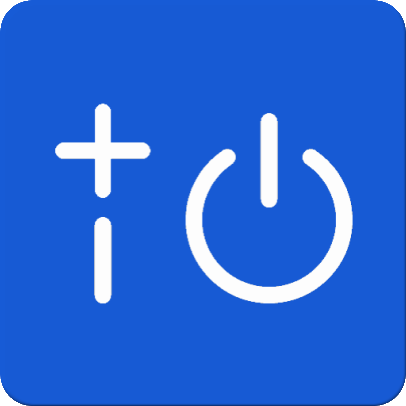

    

<h1 align="center">
    BOOM Disable Switch
</h1>

    
    &nbsp;
    

This branch disables your UE BOOM Bluetooth speaker's remote power feature.

<b>Supported speakers</b>
- BOOM 3
- MEGABOOM 3
- BOOM 2
- MEGABOOM
- BOOM
- ROLL / ROLL 2 (unconfirmed)

<b>Unsupported speakers</b>
- WONDERBOOM / WONDERBOOM 2 / WONDERBOOM 3
- BLAST / MEGABLAST (unconfirmed)
- EPICBOOM (unconfirmed)
- HYPERBOOM (unconfirmed)

Please raise a GitHub issue or send an email if you experience any issues or can help confirm support for any of the speakers listed above. The list of supported and unsupported speakers will be updated as more information is obtained. Your speaker may require a firmware update to work with this app.

Functionality is intentionally limited to switching the speaker's power to keep the app fast and lightweight. For more functionality or to update your speaker's firmware, please use the official BOOM app by Logitech: https://play.google.com/store/apps/details?id=com.logitech.ueboom

Developed independently without any affiliation with Logitech. Ultimate Ears and BOOM are trademarks of Logitech.

Get it on Google Play: https://play.google.com/store/apps/details?id=com.github.shingyx.boomswitch
